

  
  
  

<!-- # Pigmented Skin Lesion Detection in Clinical Images Using Deep Learning Methodologies -->

### Joseph Adeola

#### Erasmus Mundus Joint Master in Intelligent Field Robotic Systems Thesis, 2024

##### Advisors
- Prof. Rafael Garcia1
- Asst Prof. Tamara Petrovic2

##### Affiliations
1 ViCOROB, University of Girona  
2 FER, University of Zagreb

---

## Table of Contents
1. [Introduction](#introduction)
2. [Motivation](#motivation)
3. [Background](#background)
4. [Methodology](#methodology)
5. [Results](#results)
6. [Conclusion](#conclusion)

---

## Introduction
Pigmented skin lesions refer to any skin abnormality that appears darker than the surrounding area due to melanin or blood. These lesions range from benign moles to malignant melanoma. Early detection and accurate diagnosis are crucial for effective treatment (Figure 1).

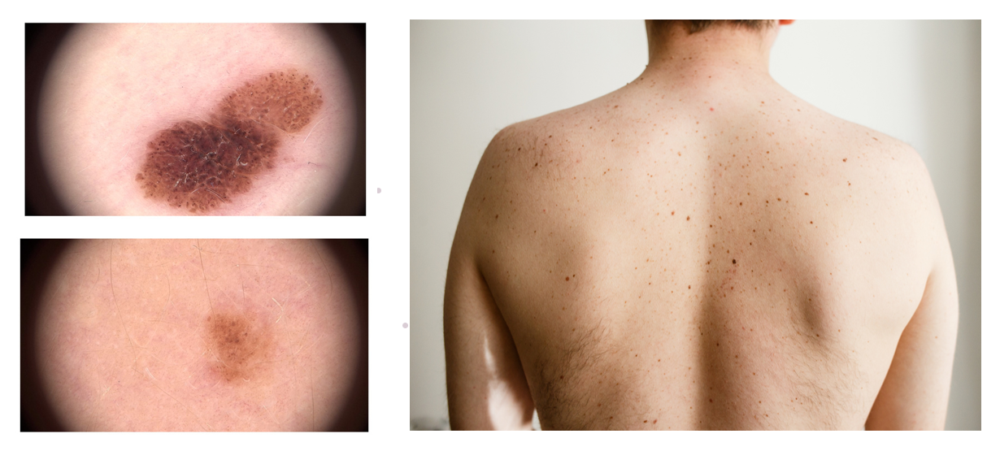
*Figure 1: Examples of pigmented skin lesions*

---

## Motivation
According to the World Health Organization (WHO), skin cancer represents a significant portion of all cancer diagnoses globally, contributing considerably to cancer-related health burdens and fatalities. In 2022, approximately 1.2 million new cases of non-melanoma skin cancer were reported worldwide, along with 331,722 new cases of melanoma, resulting in 58,667 deaths. This trend is particularly evident in countries such as the United States, Australia, Canada, and Brazil (Figure 2).

<table>
  <tr>
    <td>
      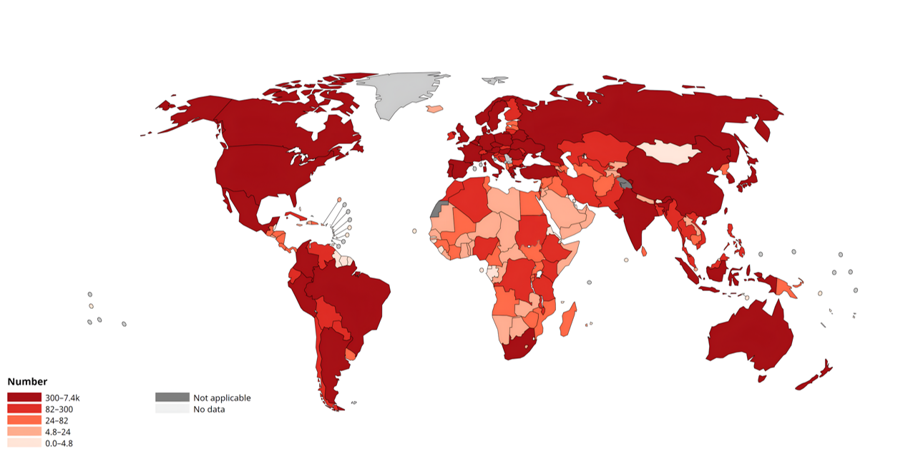
      <figcaption>Figure 2a: Global absolute number of melanoma cases</figcaption>
    </td>
    <td>
      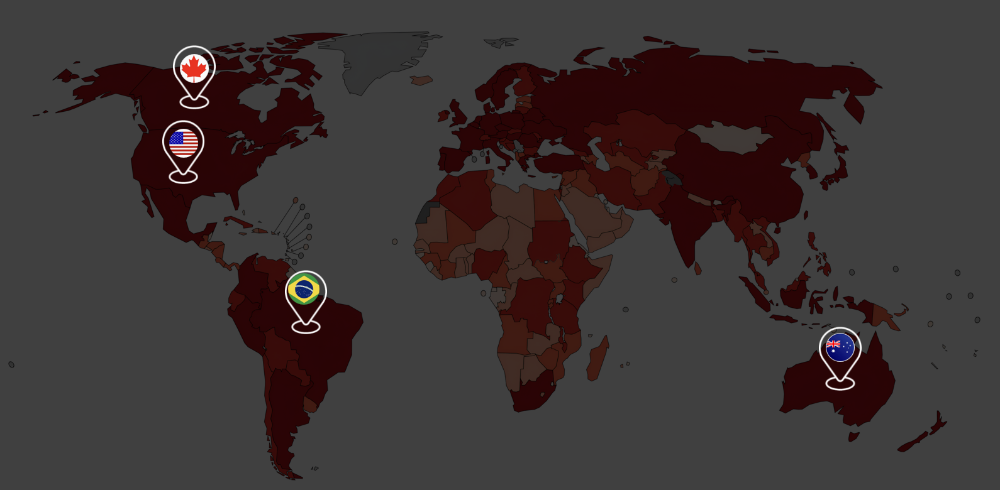
      <figcaption>Figure 2b: Countries with high melanoma incidence rates</figcaption>
    </td>
  </tr>
</table>

---

## Background
Several efforts have been made to improve the early diagnosis of skin lesions that can lead to skin cancer, as early diagnosis of melanoma can lead to a 95% survival rate.

### Traditional Diagnosis Technique
Traditional diagnosis relies on dermoscopy, a non-invasive technique where a dermatologist uses a dermoscope to capture images of individual lesions on a patient's skin for further inspection and analysis (Figure 3).

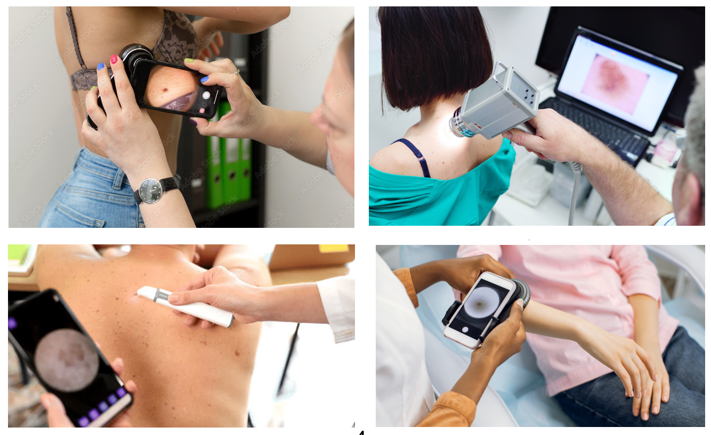
*Figure 3: Traditional diagnosis using dermoscopy*

### State-of-the-Art
While dermoscopy has been quite helpful, it is time-consuming and requires specialized dermatological expertise. Over the years, several efforts have been made to automate early lesion diagnosis and monitoring. The Canfield WB360 VECTRA scanner stands as the current standard in automated total body photography lesion-based monitoring. This system, with 46 calibrated stereo pairs, captures images of the patient's skin, reconstructs the skin in 3D, and provides a model that can be used for continuous lesion monitoring (Figure 4).

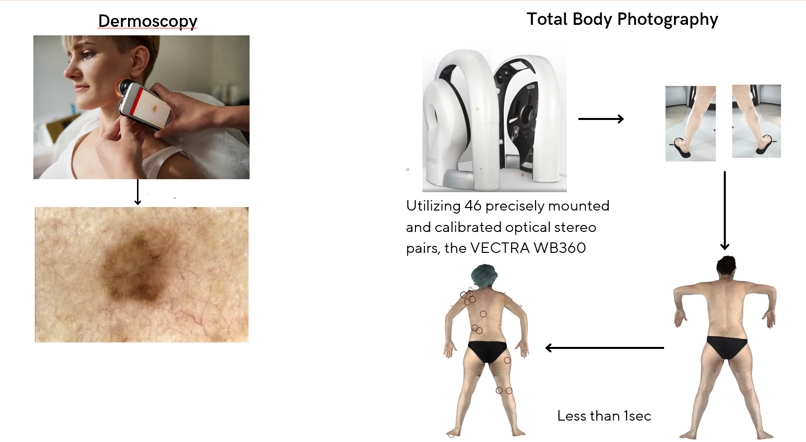
*Figure 4: Comparison of dermoscopy and total body photography*

### Dermoscopy vs Clinical Images
The major challenge with diagnosis using clinical images lies in the differences in magnification, lighting, and detail. Additionally, folds in the skin and nipples can look like lesions (Figure 5).

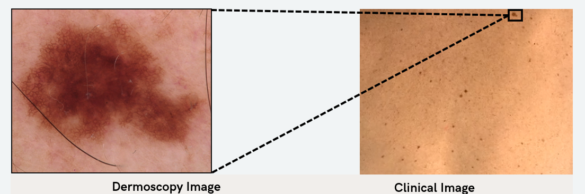
*Figure 5: Comparison of dermoscopy and clinical images*

| **Aspect**         | **Dermoscopy**                                       | **Clinical Images**                             |
|--------------------|------------------------------------------------------|------------------------------------------------|
| **Magnification**  | High magnification (10x to 100x)                     | Limited magnification (similar to the human eye)|
| **Lighting**       | Polarized light to reduce reflection and enhance subsurface visualization | Ambient or artificial light, often resulting in reflections and shadows |
| **Detail**         | Reveals detailed pigmented structures, vascular patterns, and other microscopic features | Captures surface appearance, including color and texture, but lacks subsurface detail |

Hence, we formulated our research objective to explore deep learning based approaches for automatic detection of skin lesions.

## Methodology

### Data Acquisition Pipeline
We used the Canfield WB360 scanner to capture detailed images of the skin. High-resolution 3D images were captured from a sample of 28 patients at the Clinical Hospital of Barcelona. The system, equipped with 46 stereo vision pods, captures comprehensive images of each patient's entire skin surface in a single session. We then removed identifiable features such as head, tattoos, and scars using an inpainting technique to preserve patient privacy. The 3D total body avatar was then divided into smaller, overlapping tiles measuring 1090x894 pixels (Figure 6).

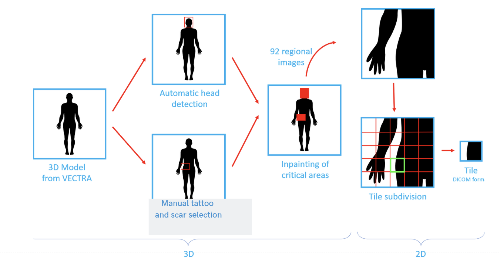
*Figure 6: Data acquisition pipeline*

### Data Preprocessing
After tile division, we removed areas that are not orthogonal to camera viewpoints to ensure that each lesion is viewed from an optimal angle. This is done by using the average of non-black pixels. We then recovered boundary lesions (lesions that fall on the edges of valid and non-valid areas) (Figure 7).

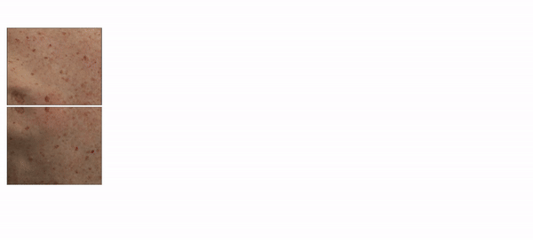
*Figure 7: Removal of non-orthogonal areas and recovery of boundary lesions*

Additionally, we filtered out non-informative images (i.e., images with more than 80% non-valid areas) and images with underwear artifacts without lesions (Figure 8).

<!-- <table>
  <tr>
    <td>
      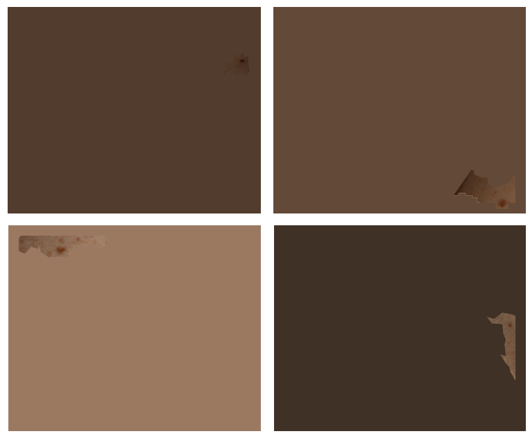
      <figcaption>Figure 8a: Non-informative tiles</figcaption>
    </td>
    <td>
      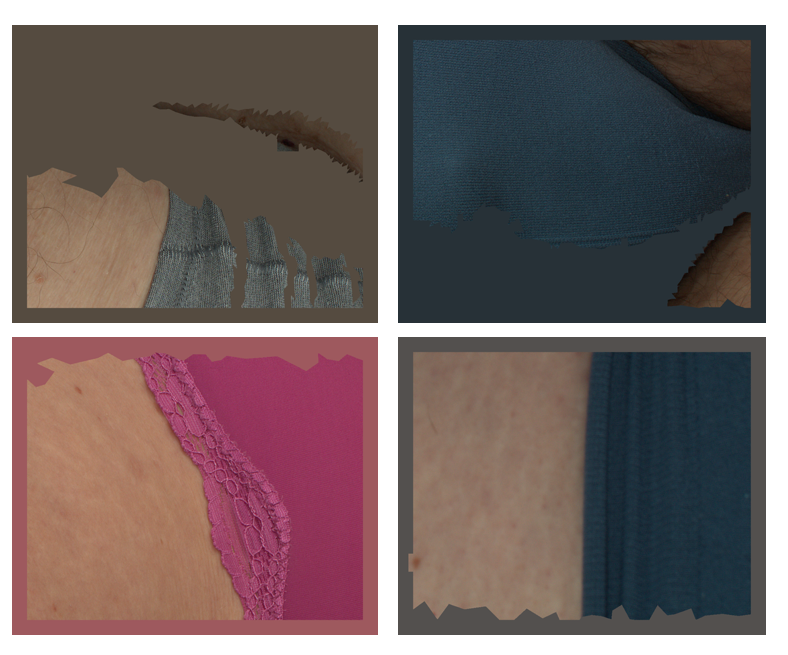
      <figcaption>Figure 8b: Underwear artifacts without lesions</figcaption>
    </td>
  </tr>
</table> -->
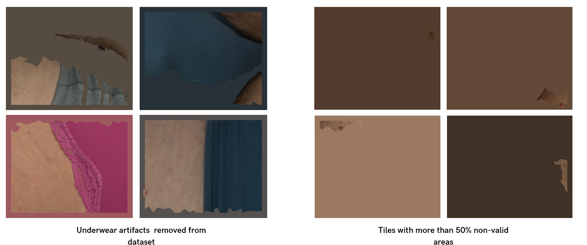
*Figure 8: Data issues*
After preprocessing, we divided the dataset into 70%, 20%, and 10% for training, validation, and testing, respectively. The dataset consists of 3288 images for training, 823 for validation, and 604 images for testing.

| **Dataset** | **Number of Lesions** | **Distribution (%)** | **Mean (mm)** | **SD (mm)** |
|-------------|------------------------|-----------------------|---------------|-------------|
| **Training** | <3mm: 3572            | <3mm: 36.2%           | 4.07          | ±1: 6.91    |
|             | 3-5mm: 4242           | 3-5mm: 42.8%          |               | ±2: 9.75    |
|             | >5mm: 2091            | >5mm: 21.1%           |               | ±3: 12.58   |
|             | **Total: 9905**       |                       |               |             |
| **Validation** | <3mm: 813         | <3mm: 34.7%           | 4.18          | ±1: 7.31    |
|             | 3-5mm: 1014           | 3-5mm: 43.3%          |               | ±2: 10.46   |
|             | >5mm: 517             | >5mm: 22.0%           |               | ±3: 13.56   |
|             | **Total: 2344**       |                       |               |             |
| **Testing** | <3mm: 222             | <3mm: 15.8%           | 4.94          | ±1: 8.94    |
|             | 3-5mm: 646            | 3-5mm: 46.0%          |               | ±2: 11.95   |
|             | >5mm: 534             | >5mm: 38.1%           |               | ±3: 16.62   |
|             | **Total: 1402**       |                       |               |             |

### Model Architecture
We evaluated several model architectures to identify the most effective one for our task, focusing on one-stage and two-stage object detectors, segmentation-based models, and unsupervised approaches. These architectures include YOLOv8, YOLOv9, RetinaNet, Real-Time Detection Transformer, Faster-RCNN, Mask-RCNN, UNet, Attention-UNet, ResNet-UNet, DEYO, DINO, and CutLER. We limited the scope of our research to just lesion detection without classification. Also, we only report the results from top-performing models (Figure 9).

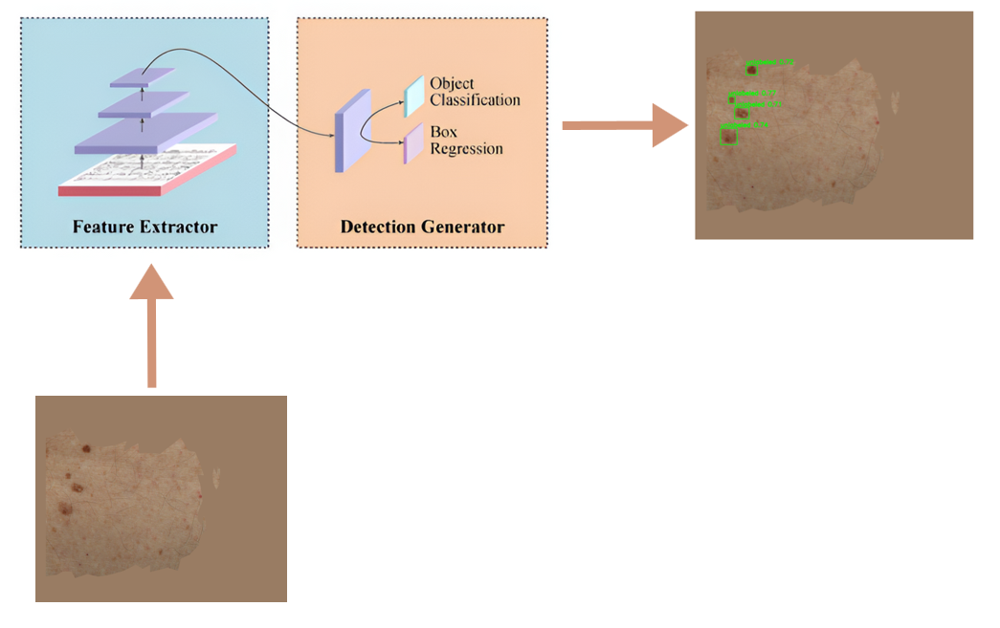
*Figure 9: One-stage object detectors used in the study*

### Model Ensemble 
We explored the possibility of ensembling both detectors and segmentation models to leverage the strengths of each individual model. The ensemble approach helps reduce variance, improve robustness, and enhance the overall accuracy of the detection system. We used three ensembling methods (Figure 10):
- **Affirmative Approach**: This method considers a detection valid if any of the models in the ensemble identifies a lesion.
- **Consensus Approach**: This method requires a majority of the models to agree on a detection for it to be considered valid.
- **Unanimous Approach**: This method only considers a detection valid if all models in the ensemble agree.

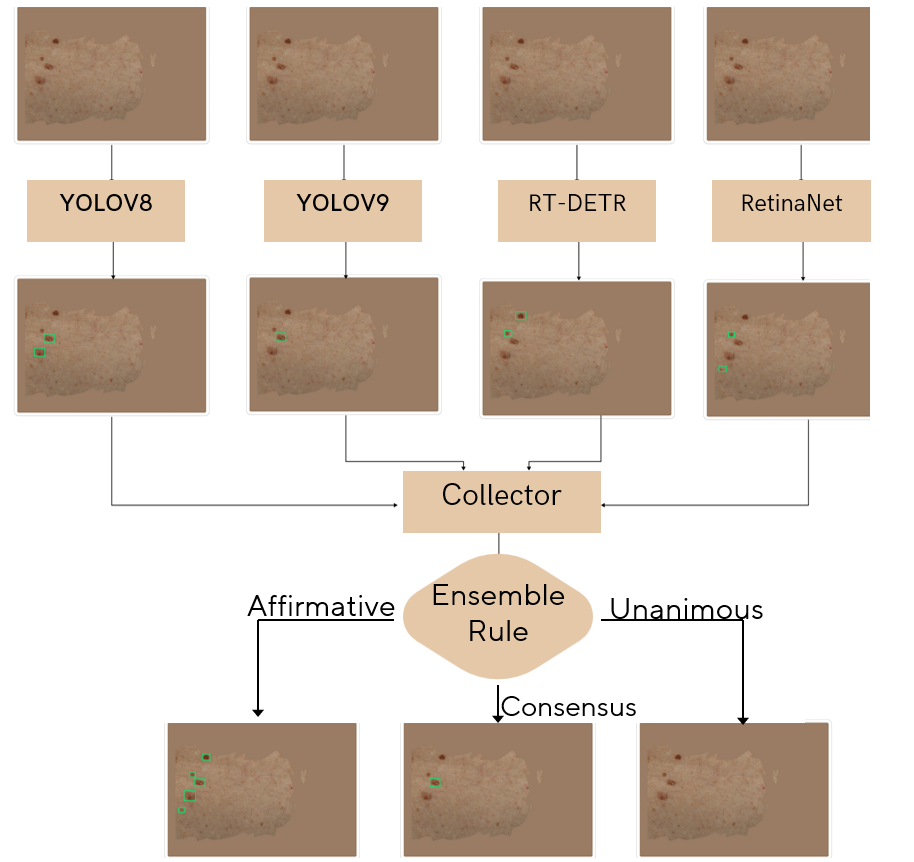
*Figure 10: Ensemble methods used in the study*

## Results
In comparing model performance, we used standard object detection metrics such as average precision, average recall, precision, recall, and F1-score. To set a baseline, we used the lesion detector provided by Canfield, which is the best lesion detector for clinical images.

### Quantitative Performance of Canfield Baseline on Test Dataset
The Canfield baseline model was evaluated on a test dataset. This provided a benchmark for comparing the performance of our proposed models (Figure 11).

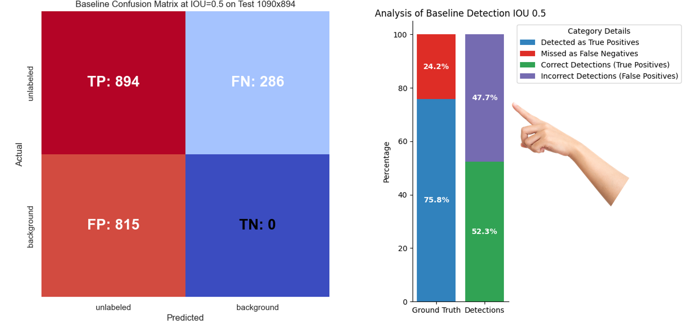
*Figure 11: Quantitative performance of Canfield baseline on test dataset*

From the figure, we realize that we pay a higher false positive price in order to detect 894 true positive lesions. Also, the analysis shows that approximately 47% of the time a lesion is detected, it is actually false, causing undesirable concerns.

### Qualitative Performance of Canfield Baseline on Test Dataset
The image below showcases a sample of the Canfield baseline model's detections on the test dataset (Figure 12).

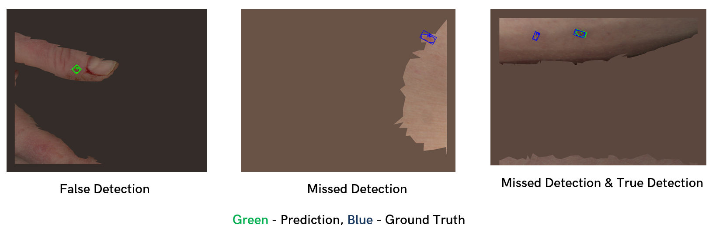
*Figure 12: Qualitative performance of Canfield baseline on test dataset*

### Quantitative Performance Comparison of Detectors on Test Dataset
A comparative analysis of different detection models was conducted to identify the best performer. Models were compared based on their average precision and average recall values. The best-performing model was the YOLOv8-x model with an average precision at IOU threshold of 0.5 (Figure 13).

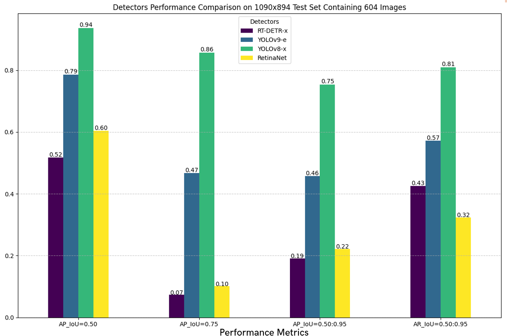
*Figure 13: Quantitative performance comparison of detectors on test dataset*

### Quantitative Performance Comparison of Best Detector and Canfield Baseline on Test Dataset
Comparing the performance of the best single detector model, we realized our model performs significantly better than the state-of-the-art standard (Figure 14).

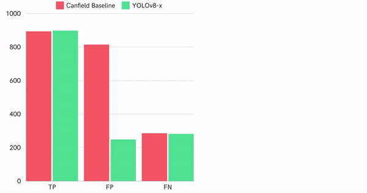
*Figure 14: Quantitative performance comparison of best detector and Canfield baseline on test dataset*

Particularly, our model generates fewer false positives, which is shown by the 69% difference in false positive rate and also in F1-score difference (0.77 compared to baseline 0.62).

### Qualitative Performance of Best Detector
The figure below shows some actual detections from the YOLOv8-x model, which was the best-performing detector among all models explored (Figure 15).

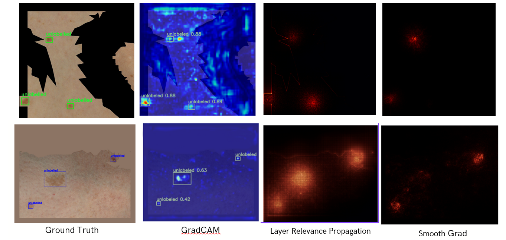
*Figure 15: Qualitative performance of best detector (YOLOv8-x)*

We observed that when we used black pixels to remove non-valid areas (first row), the model made the right decisions for the wrong reasons, as shown by the noisy Grad-CAM. Using the average of non-black pixels (second row) helped the model focus better on actual lesion features.

### Attention-UNet Visualization for Skin Lesion Segmentation
The Attention-UNet model's segmentation results were visualized to assess its performance. The attention map shows that the model focuses on actual lesion features (Figure 16).

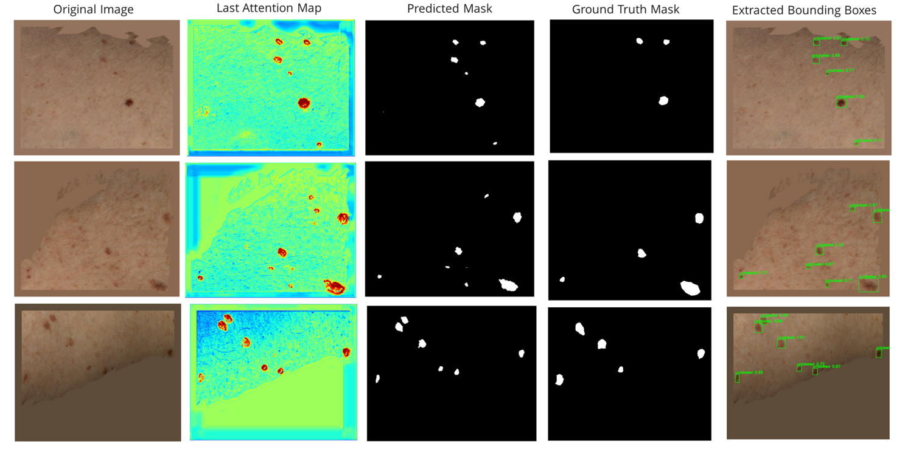
*Figure 16: Attention-UNet visualization for skin lesion segmentation*

### Quantitative Performance Comparison of Segmentation Models
Segmentation models were compared quantitatively to examine if there was an improvement in performance compared to the detectors. The goal of adding segmentation to the task is to improve lesion localization and boundary delineation. The results show that the YOLOv8-x-segmentation model had the best performance compared to other models (Figure 17).

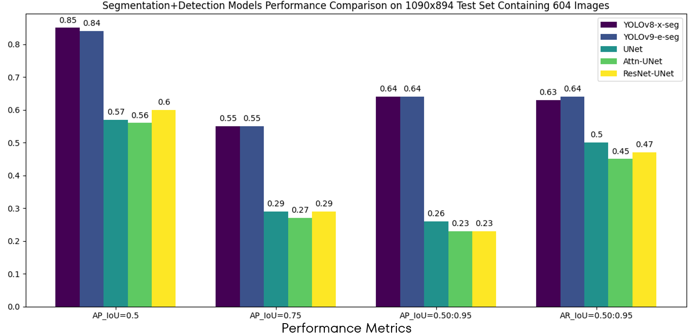
*Figure 17: Quantitative performance comparison of segmentation models*

### Quantitative Performance Comparison of Detector Ensemble Techniques
We compared the performance of ensembling four detection models (YOLOv8-x, YOLOv9-e, RTDETR, RetinaNet) and five segmentation models (YOLOv8-x-seg, YOLOv9-e-seg, UNet, Attention-UNet & ResNet UNet) using the three ensemble techniques discussed earlier. 
The results show that the best ensembling method in terms of average precision performance is the affirmative method of ensembling detectors, as shown by the plot in the figure below. While this method has a higher AP, it generates more false positives and has a lower F1-score compared to the consensus method of ensembling detectors (Figure 19).

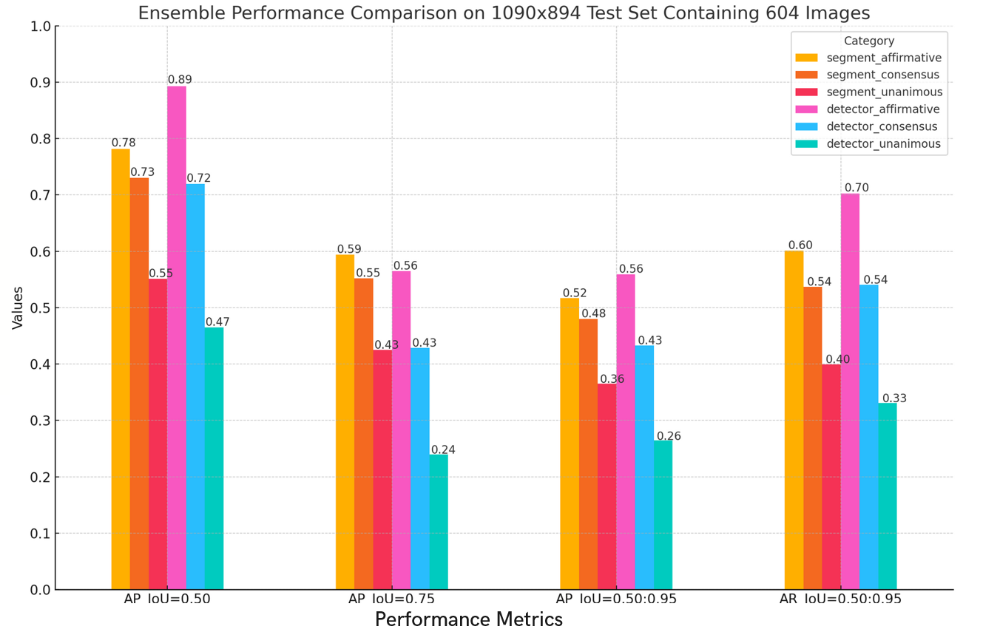
*Figure 18: Quantitative performance comparison of detector ensemble techniques*

Some results from ensembling detectors are shown below (Figure 19).

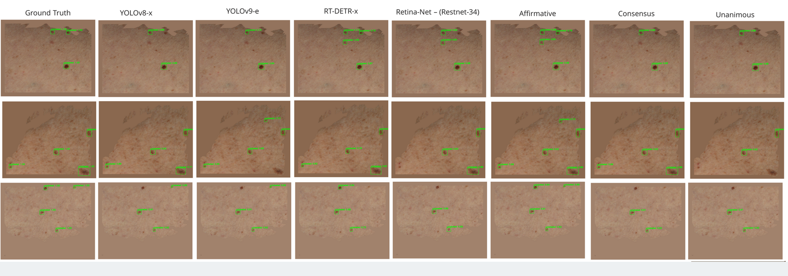
*Figure 18: Results from ensembling detectors*

Finally, we compare the best individual model, the best single detection model and the best segmentation model with the baseline.

| **Model**                   | **F1-Score** |
|-----------------------------|--------------|
| Canfield Baseline           | 0.62         |
| Best Detector (YOLOv8-x)    | 0.77         |
| Best Segmentation (YOLOv8-x-seg) | 0.80    |
| Best Ensemble (Consensus) | 0.81         |

## Conclusion

### Conclusion & Future Work
Significant improvements were observed compared to the baseline, showing promising results for early diagnosis and continuous lesion monitoring. 
While the consensus method of ensembling detectors had the best F1-score, the computational time is significantly higher than using a single model (9.3 minutes compared to 2.8 minutes on 604 images during inference). Thus, our study shows the possibility of improving clinical lesion monitoring.

### Future Work
- Implement a learning-based hair removal strategy.
- Test the model on a larger dataset.
- Validate the model in a real-world setting.